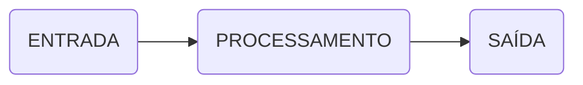

# Apostila de Algoritmo e Programação

# Capítulo: Introdução

_Professor:_  Evandro Jardini

## Conceitos iniciais

**Lógica**
 A lógica de programação é necessária para pessoas que desejam trabalhar com desenvolvimento de sistemas e
programas, ela permite definir a sequência lógica para o desenvolvimento.

Então o que é lógica?
>Lógica de programação é a técnica de encadear pensamentos para atingir determinado objetivo

**Sequência Lógica**  
Estes pensamentos, podem ser descritos como uma sequência de instruções, que devem ser seguidas para se cumprir uma determinada tarefa.  

>Sequência Lógica são passos executados até atingir um objetivo ou solução de um problema.

**Instruções**  

- Em informática, instrução é a informação que indica a um computador uma ação elementar a executar.
  
- Convém ressaltar que uma ordem isolada não permite realizar o processo completo, para isso é necessário um conjunto de instruções colocadas em ordem sequencial lógica.
  
- Por exemplo, se quisermos fazer uma omelete de batatas, precisaremos colocar em prática uma série de instruções:
  - Descascar as batatas, bater os ovos, fritar as batatas, etc...

- É evidente que essas instruções tem que ser executadas em uma ordem adequada: **não se pode bater os ovos da omelete antes de quebrá-los**.

**Algoritmo**  

- Um algoritmo é formalmente uma sequência finita de passos que levam a execução de uma tarefa.
- Podemos pensar em algoritmo como uma receita, uma sequência de instruções que dão cabo de uma meta específica.
- Estas tarefas não podem ser redundantes nem subjetivas na sua definição, devem ser claras e precisas.
- Exemplo:
* Algoritmo para somar dois números quaisquer*:
```
Escreva o primeiro número no retângulo A.
Escreva o segundo número no retângulo B.
Some o número do retângulo A com o número do retângulo B.
Coloque o resultado da soma de A com B no retângulo C.

Retangulo A        Retangulo B             Retangulo C
 ┌──────┐          ┌──────┐                  ┌──────┐                                   
 │  ?   |          │  ?   |                  │  ?   |
 └──────┘          └──────┘                  └──────┘
```


## Formas de Representação de Algoritmos  

**Descrição Textual ou Narrativa**

- VANTAGENS:  
 - O português é bastante conhecido por nós;
- DESVANTAGENS:  
 - imprecisão;  
 - pouca confiabilidade (a imprecisão acarreta a desconfiança);  
 - extensão (normalmente, escreve-se muito para dizer pouca coisa).

<br/>
<br/>
<br/>

**Fluxograma**  

O fluxograma é um tipo de algoritmo que utiliza símbolos gráficos para representar as ações ou instruções a serem seguidas.  

Assim como o pseudocódigo, o fluxograma é utilizado para organizar o raciocínio lógico a ser seguido para a resolução de um problema ou para definir os passos para a execução de uma tarefa. 

Também é utilizado para documentar rotinas de um sistema, mas só é recomendado para os casos pouco extensos.  


**Pseudolinguagens**

O pseudocódigo é um tipo de algoritmo que utiliza uma linguagem flexível, intermediária entre a linguagem Narrativa e a linguagem de programação.

É também para documentar rotinas de um sistema.

A palavra 'pseudocódigo' significa 'falso código'. Esse nome se deve à proximidade que existe entre um algoritmo escrito em pseudocódigo e a maneira pela qual um programa é representado em uma linguagem de programação.


**Fases**
Entretanto ao montar um algoritmo, precisamos primeiro dividir o problema apresentado em três fases fundamentais.



Onde temos:
**ENTRADA**: São os dados de entrada do algoritmo;  
**PROCESSAMENTO**: São os procedimentos utilizados para chegar ao resultado final;  
**SAÍDA**: São os dados já processados. São as informações.  


### Exemplo de Algoritmo
Imagine o seguinte problema:  
- Calcular a média final dos alunos da disciplina de algoritmos.
- Sabendo que a média é calculada por: (Prova1 + Prova2 + Prova3 + Prova4) /4

Para montar o algoritmo proposto, faremos três perguntas:  

* **Quais são os dados de entrada?**  
  R: Os dados de entrada são Prova1, Prova2, Prova3 e Prova4.
  
* **Qual será o processamento a ser utilizado?**  
  R: O procedimento será somar todos os dados de entrada e dividi-los por 4 (quatro)
  
* **Quais serão os dados de saída?**  
  R: O dado de saída será a média final.  

  


Inicialmente, temos de solicitar as 4 notas, depois calcular a média e, por mim, mostrar ao usuário a média das notas:

```Go
Algoritmo
• Receba a nota da prova1  // Entreda de dados  
• Receba a nota de prova2  // Entreda de dados  
• Receba a nota de prova3  // Entreda de dados    
• Receba a nota da prova4  // Entreda de dados  

• Some todas as notas e divida o resultado por 4  // Processamento dos dados

• Mostre o resultado da divisão  // Saída dos daddos.
```


```
